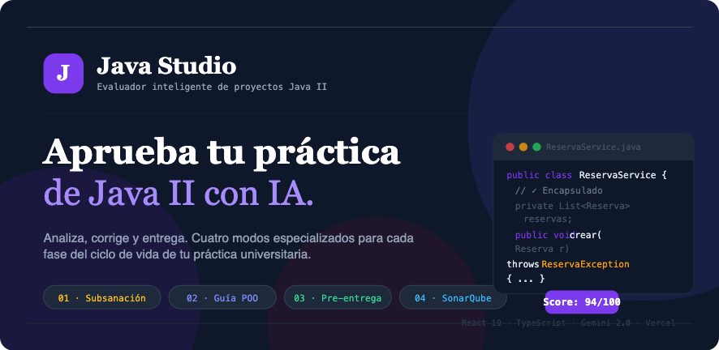

# Java Studio

> Evaluador inteligente de proyectos Java II para estudiantes universitarios — powered by Gemini AI

<p align="center">
  
</p>

[](https://javastudio.vercel.app)
[](https://react.dev)
[](https://www.typescriptlang.org)
[](https://tailwindcss.com)
[](https://ai.google.dev)

---

## ¿Qué es Java Studio?

Java Studio es una herramienta pedagógica para estudiantes de **Programación Orientada a Objetos (Java II)** que combina análisis de código con inteligencia artificial para ayudarte a entender los errores, mejorar tu código y preparar entregas limpias.

Carga tus archivos `.java`, pega el enunciado o sube el feedback de tu profesora — y obtén propuestas de mejora concretas, métricas de calidad y guías paso a paso.

---

## Modos de evaluación

### 01 · Subsanación de feedback
Compara tu borrador suspendido (`JAVAII_NO`) con tu versión corregida (`JAVAII-FIXED`) frente a los comentarios del docente. Obtén propuestas de código real para cerrar cada gap y maximizar la nota.

### 02 · Guía POO desde enunciado
Pega el enunciado de tu práctica y recibe un esqueleto de clases, interfaces y excepciones con métodos `// TODO` para que programes paso a paso sin parálisis de lienzo en blanco.

### 03 · Pre-entrega y anti-IA
Detecta carpetas basura de IDEs (`.idea/`, `target/`, `.vscode/`), artefactos de sistema ocultos y comentarios con marcas de generación automática. Descarga el proyecto saneado con informe incluido.

### 04 · SonarQube y SOLID
Auditoría estática con reglas reales de SonarQube (`java:S106`, `java:S112`, `java:S3776`), Quality Gate, complejidad ciclomática y generación de suites de pruebas JUnit 5 con Mockito.

---

## Refactorización y Mejoras Recientes (Último Commit)

Se ha realizado una refactorización arquitectónica significativa en el frontend y se han corregido errores críticos de compilación para mejorar la mantenibilidad y robustez del proyecto.

*   **Centralización del Estado con React Context:** Se introdujo `WorkspaceContext` para gestionar el estado global de la aplicación, incluyendo los archivos del proyecto (`noFiles`, `fixedFiles`, `teacherDoc`) y las opciones de configuración de cada modo.
    *   Esto elimina el "prop drilling" (paso de propiedades a través de múltiples niveles), simplificando componentes como `App`, `Home` y `Navbar`.
*   **Reestructuración de Componentes:** El componente `App.tsx` se dividió en `App.tsx` (que ahora solo actúa como proveedor del contexto) y `AppContent.tsx` (que contiene la lógica principal de la aplicación). Se ha extraído la barra de navegación de modos a un componente reutilizable `ModeNavBar.tsx`.
*   **Corrección de Errores de TypeScript:** Se resolvieron los errores de compilación relacionados con el uso de JSX en archivos `.ts` (renombrándolos a `.tsx`) y se añadió la configuración necesaria (`vite-env.d.ts`) para que TypeScript reconozca las importaciones de módulos CSS.
*   **Limpieza de Código:** Contenido estático (modales, FAQs) se centralizó en `src/data/constants.tsx`, y se mejoró el tipado en `src/data/modes.tsx`.
*   **Autenticación JWT en Backend (Setup Inicial):** Se ha configurado el servidor Express para usar JSON Web Tokens (JWT) para la autenticación, añadiendo un `authMiddleware` y modificando el endpoint de login para emitir tokens.

---

## Stack técnico

| Capa | Tecnología |
|---|---|
| Frontend | React 19 + TypeScript + Tailwind CSS v4 |
| Backend | Express (local) / Vercel Serverless Functions (producción) + **jsonwebtoken** |
| IA | Google Gemini 2.0 Flash con structured outputs |
| Base de datos | Upstash Redis (sesiones y perfiles de usuario) |
| Auth | Google OAuth 2.0 + autenticación propia con email/contraseña + **JWT** |
| Drive | Google Drive API v3 (importación de proyectos) |
| Deploy | Vercel |

---

## Instalación local

```bash
git clone https://github.com/Blancadum/javastudio.git
cd javastudio
npm install
```

Crea un archivo `.env` en la raíz:

```env
APP_URL=http://localhost:3000
GEMINI_API_KEY=tu-clave-de-google-ai-studio
OAUTH_CLIENT_ID=tu-client-id.apps.googleusercontent.com
OAUTH_CLIENT_SECRET=tu-client-secret
UPSTASH_REDIS_REST_URL=https://xxxx.upstash.io
UPSTASH_REDIS_REST_TOKEN=tu-token
JWT_SECRET=un-secreto-muy-largo-y-dificil-de-adivinar-12345!
```

```bash
npm run dev
```

Abre [http://localhost:3000](http://localhost:3000).

---

## Variables de entorno

| Variable | Descripción | Dónde obtenerla |
|---|---|---|
| `GEMINI_API_KEY` | Clave de la API de Gemini | [aistudio.google.com/apikey](https://aistudio.google.com/apikey) |
| `OAUTH_CLIENT_ID` | Client ID de Google OAuth | Google Cloud Console → Credenciales |
| `OAUTH_CLIENT_SECRET` | Client Secret de Google OAuth | Google Cloud Console → Credenciales |
| `APP_URL` | URL base de la app | `http://localhost:3000` en local, tu dominio en producción |
| `UPSTASH_REDIS_REST_URL` | URL de la base de datos Redis | [upstash.com](https://upstash.com) |
| `UPSTASH_REDIS_REST_TOKEN` | Token de acceso a Redis | [upstash.com](https://upstash.com) |

---

## Deploy en Vercel

1. Importa el repositorio en [vercel.com](https://vercel.com)
2. Selecciona **Other** como framework preset
3. Añade las 6 variables de entorno en Settings → Environment Variables
4. Deploy

El `vercel.json` incluido gestiona automáticamente el routing entre el frontend (Vite) y las funciones serverless (`/api`).

---

## Estructura del proyecto

```
javastudio/
├── api/                    # Funciones serverless de Vercel
│   ├── _lib/               # Helpers compartidos (OAuth, IA, Redis)
│   ├── auth/               # Endpoints de autenticación
│   ├── analyze/            # Endpoints de análisis por modo
│   ├── drive/              # Integración con Google Drive
│   ├── chat/               # Tutor IA conversacional
│   └── generate/           # Generación de código mejorado
├── server/                 # Servidor Express para desarrollo local
│   ├── aiService.ts        # Cliente Gemini con fallback
│   └── userStore.ts        # Store de usuarios (local)
├── src/
│   ├── components/         # Componentes React por feature
│   ├── data/               # Tipos TypeScript y datos de ejemplo
│   └── App.tsx             # Raíz de la aplicación
├── server.ts               # Servidor Express unificado (dev)
└── vercel.json             # Configuración de deploy
```

---

## Comunidad

Proyecto creado en el contexto de [Fullstack Dev Lovers](https://fullstack-dev-lovers.vercel.app/) — una comunidad de desarrolladores en formación.

---

## Licencia

MIT
